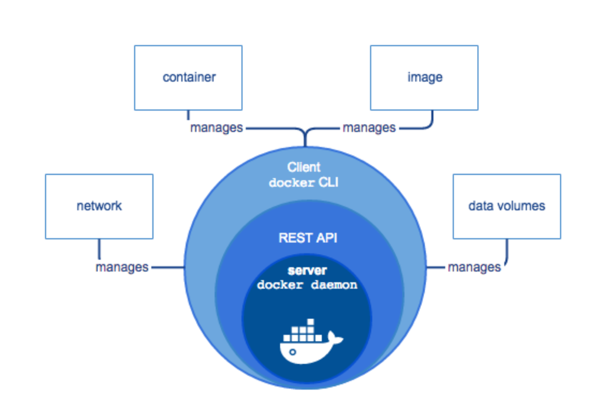
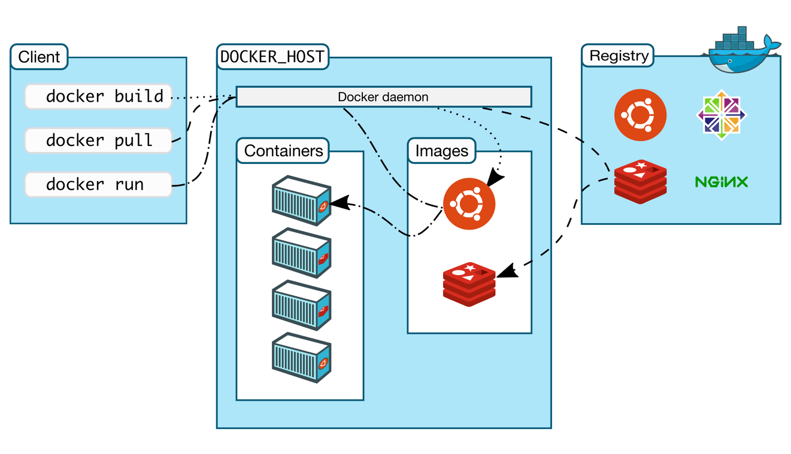

# Docker

## Command 
```shell
docker build
docker pull
docker run 
docker rm
docker ps
```



** If images not there, then docker will get from Registry"
docker run hello-world
docker run --name nginx-demo -p 1234:80 nginx:alpine
docker run --name allianz-demo-dockerfile2-run -p 2222:80 -d --rm allianz-demo-dockerfile2
docker run --name nginx-demo -d -p 1234:80 nginx:alpine
docker run --name nginx-demo -d -p 1234:80 --rm nginx:alphine
docker cp ./index.html nginx-demo:/usr/share/nginx/html
docker exec -ti nginx-demo ash
-- ash much smaller than bash
docker commit nginx-demo allianz-demo 


** From Dockerfile
Dockerfile
FROM nginx:alpine
COPY index.html /usr/share/nginx/html
ENV SOME-VALUE "hello-allianz"
EXPOSE 80
WORKDIR ./app
COPY dist .
ENTRYPOINT ["java", "sample"]

docker build . --tag allianz-demo-dockerfile -f Dockerfile2
** --tag to indetify name of images "
** -f to indetify name of Dockerfile

Sample DockerFile
FROM adoptopenjdk

http://localhost:1234/weatherforecast

/usr/bin/java -Dsun.misc.URLClassPath.disableJarChecking=true -Xmx2048M -Xms128M \
        -Djava.io.tmpdir=/data/opt/middleware/deployment/agency-compensation/tmp \
        -jar /data/opt/middleware/deployment/agency-compensation/ncs-commission-service/sit/ncs-commission-service-6.0.0-SNAPSHOT.jar \
        --spring.profiles.active=sit


